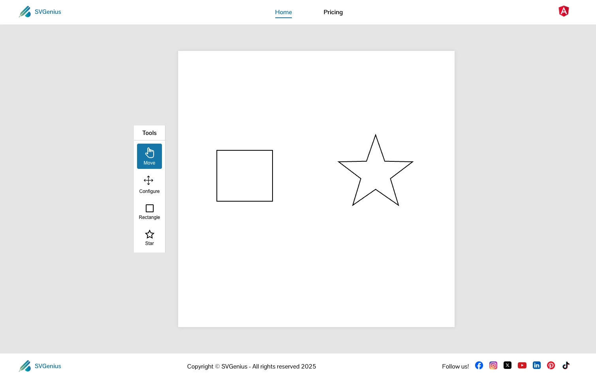
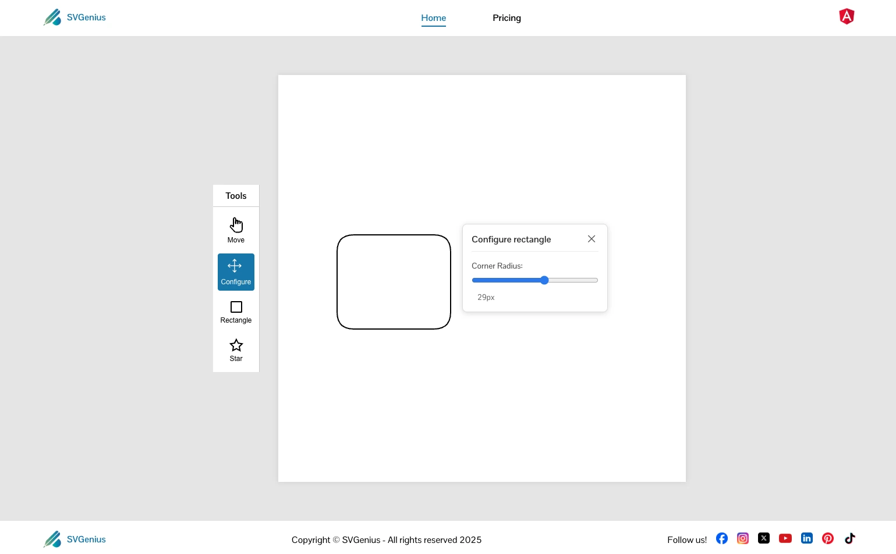
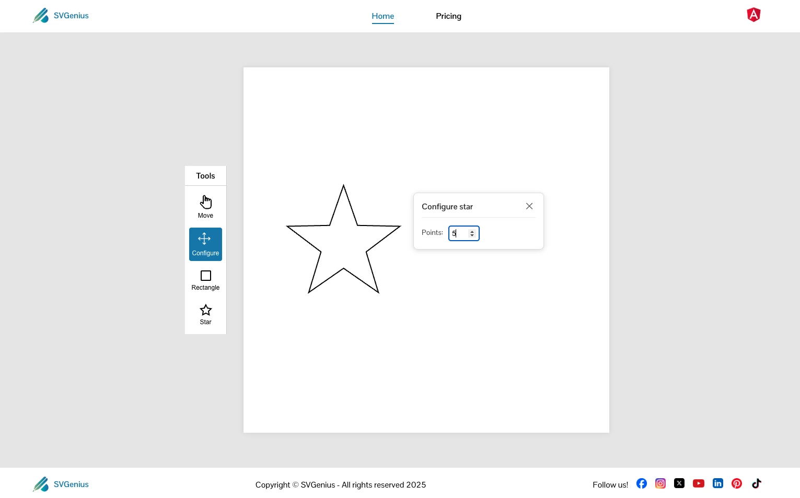
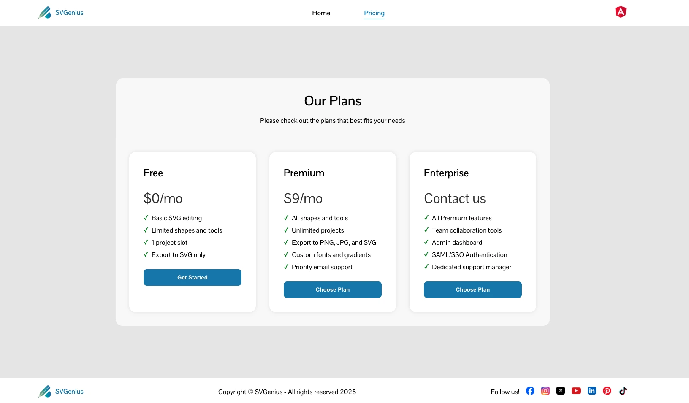
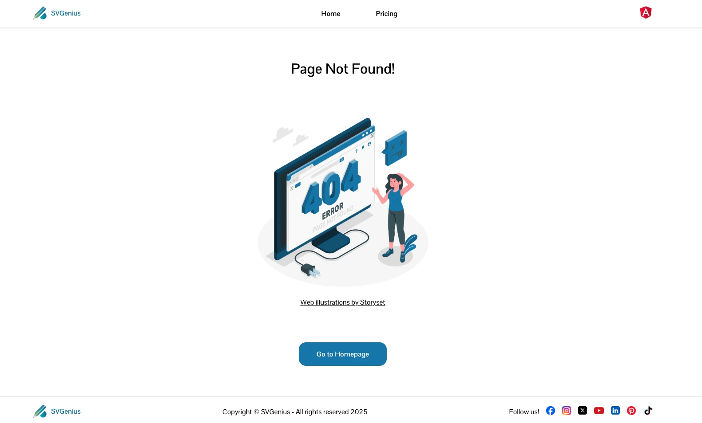

# SVGenius - Your Interactive SVG Editor

This project was generated and developed using [Angular CLI](https://github.com/angular/angular-cli) version 19.2.12.

<!--  -->


## Development server

To start a local development server, run:

```bash
ng serve
```

```bash
npm start
```

Once the server is running, open your browser and navigate to `http://localhost:4200/`. The application will automatically reload whenever you modify any of the source files.

## Application Structure

This is a tree view of the current application structure:

```text
src/
├── app/
│   ├── components/
│   ├── core/
│   │   └── services/
│   │       ├── canvas/
│   │       │   ├── canvas-store/
│   │       │   ├── drawing/
│   │       │   └── mouse-events/
│   │       └── id-generator/
│   ├── layouts/
│   │   └── main-layout/
│   └── pages/
│       ├── home/
│       ├── pricing/
│       └── not-found/
└── assets/
```


## Home Page

This is the main page and this is where the canvas sits with the editor where you can add rectangles and stars and modify and move them across the canvas.



#### Toolbar

At the left side of the canvas there is a toolbar with 4 tools:
1. Move
2. Configure
3. Rectangle
4. Star

## Rectangle configurations

When you add a rectangle to the canvas you can modify its corners by increasing the border-radius and it will give the rectangle a rounded look.



## Star configurations

As for the star you can increase the amount of points it has and move it around the canvas.



## Pricing page

A page where you can choose a plan, you can use the free version or you can upgrade to have more tools and possibilities as described in the pricing cards shown in the page.



## Not found page

In case you run in trouble or input an incorrect url address by accident you have a custom page with a button to return to the home/main page.



## SVGenius - Production - Vercel

This application is online and deployed by [Vercel](https://vercel.com/) You can use this application online by visiting the website → [SVGenius on Vercel](https://svgenius-ten.vercel.app/)

# License
© Developed with a lot of &#10084; by Hugo Ramon Pereira -> [Portfolio](https://hugoramonpereira.dev/) -> [LinkedIn](https://www.linkedin.com/in/hugo-ramon-pereira/) 🇧🇷
